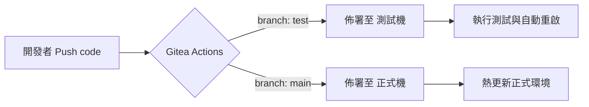

# 船務部帳務系統 - 專案規劃記錄

## 專案概述

- **專案名稱**：船務部帳務系統
- **建立日期**：2026年3月
- **開發工具**：Kiro (AI IDE) + Spec-Driven Development (SDD)
- **技術堆疊**：Python FastAPI + SQLite + Jinja2 Templates + Vanilla JavaScript

---

## 系統架構

### MVC 架構

本系統採用 MVC（Model-View-Controller）架構：

| 層級 | 檔案 | 說明 |
|------|------|------|
| **Model（模型）** | `models.py` | 定義 Ship、Voyage、ChargeItem、Invoice、InvoiceLine 資料模型 |
| **View（視圖）** | `templates/*.html` | HTML 模板，負責呈現資料 |
| **Controller（控制器）** | `routers/*.py` | 處理業務邏輯、驗證、資料庫操作 |

### 技術細節

- **後端框架**：FastAPI
- **資料庫**：SQLite（開發環境）→ PostgreSQL（正式環境）
- **ORM**：SQLAlchemy
- **前端**：HTML + CSS + Vanilla JavaScript（Modal 互動）
- **部署方式**：Docker（可選）

### 資料流程

```
使用者操作 → JavaScript (fetch API) → FastAPI Router → SQLAlchemy → SQLite
                                    ↓
                              JSON Response
                                    ↓
                              JavaScript 更新 DOM
```

---

## 功能模組

### 1. 船舶管理 (`/ships`)
- 新增、編輯、刪除船舶
- 欄位：船舶代碼、船名、船旗國、船型

### 2. 航次管理 (`/voyages`)
- 新增、編輯、刪除航次
- 欄位：航次編號、船舶、出發港、目的港、預計出發/抵達日期、狀態

### 3. 收費項目管理 (`/charge-items`)
- 新增、編輯、刪除收費項目
- 欄位：項目代碼、項目名稱、幣別、預設單價

### 4. 帳務管理 (`/invoices`)
- 新增、編輯、刪除帳單
- 帳單明細管理
- 匯出 CSV / Excel
- 列印功能
- **套用到新費用單**：一鍵複製現有帳單明細至新日期、新編號。

### 5. 客戶管理 (`/customers`)
- 新增、編輯、刪除客戶
- 欄位：客戶名稱、負責人、發票前綴 (Invoice Prefix)、聯絡方式等。
- 功能：建立帳單時自動帶入客戶預設的發票前綴與負責人。

### 6. 自動通知系統 (Background Tasks)
- **逾期提醒 (雙重檢查)**：
    - 每日凌晨 01:00 定期檢查。
    - 每小時整點 (時:00) 自動檢查。
- **條件**：超過 7 天未完成且尚未提醒。
- **技術**：使用 APScheduler 排程，透過 SMTP 發送 HTML 郵件。

---

## 資料庫決策記錄

### 討論時間：2026年3月24日

### 背景
- 使用人數：10人以下
- 主機環境：Windows Server
- 預算：0元

### 選項分析

| 資料庫 | 費用 | 並發能力 | 備份方式 | 管理工具 |
|--------|------|----------|----------|----------|
| **SQLite** | $0 | ⚠️ 差（會鎖表） | 手動複製檔案 | DB Browser |
| **PostgreSQL** | $0 | ✅ 優 | 自動內建 | pgAdmin |
| **MySQL** | $0 | ✅ 優 | 自動內建 | MySQL Workbench |
| **SQL Server Express** | $0 | ✅ 優 | 自動內建 | SSMS |

### 關鍵術語說明

**並發（Concurrency）**
- 定義：多人同時操作資料庫
- SQLite 問題：鎖住整個資料表，會造成其他人等待
- PostgreSQL 優勢：只鎖住單一資料列，多人可以同時操作

### 最終決策

**開發階段**：使用 SQLite
- 快速開發
- 無需安裝額外軟體
- 本機測試方便

**正式環境**：改用 PostgreSQL
- 費用：$0
- 並發：支援多人同時使用
- 備份：內建自動備份
- 管理工具：pgAdmin（免費）

### 遷移計劃

1. Windows Server 安裝 PostgreSQL
2. 修改 `database.py` 連接字串
3. 執行資料遷移（SQLite → PostgreSQL）
4. 設定自動備份

---

## 討論摘要

### Q1: 這種方式是有用 MVC 的方式嗎？
**A**: 是的，採用標準 MVC 架構：
- Model: models.py (SQLAlchemy ORM)
- View: templates/*.html (Jinja2)
- Controller: routers/*.py (FastAPI)

### Q2: 如果要發佈為正式的話，是不是要用 Docker？
**A**: 不一定，但推薦使用。Docker 可以確保開發環境與正式環境一致。

### Q3: SQLite 會有多人使用的問題嗎？
**A**: 會的。SQLite 適合單人或少人使用（5人以下），多人同時編輯會造成鎖表等待。

### Q4: 10人以下可以用 SQLite 嗎？
**A**: 可以，但建議搭配手動備份腳本。長期正式營運建議用 PostgreSQL。

### Q5: 先用 SQLite，以後再改 PostgreSQL，會很麻煩嗎？
**A**: 不會麻煩。因為使用 SQLAlchemy ORM，只需修改連接字串即可無痛遷移。

---

## 檔案結構

```
shipping-accounting/
├── main.py                 # FastAPI 應用程式入口
├── database.py             # 資料庫連接設定
├── models.py               # 資料模型定義
├── seed_data.py            # 範例資料
├── routers/
│   ├── ships.py           # 船舶 API
│   ├── voyages.py         # 航次 API
│   ├── charge_items.py    # 收費項目 API
│   ├── invoices.py        # 帳務 API
│   └── invoice_lines.py   # 帳務明細 API
├── templates/
│   ├── base.html          # 基礎模板
│   ├── ships/list.html    # 船舶列表（Modal）
│   ├── voyages/list.html  # 航次列表（Modal）
│   ├── charge_items/list.html  # 收費項目（Modal）
│   └── invoices/          # 帳務相關模板
└── static/
    └── style.css          # 樣式表（含 Modal CSS）
```

---

## 下一步

1. ✅ 完成基本 CRUD 功能（船舶、航次、收費項目、帳務、客戶）
2. ✅ 改用 Modal 互動（不跳頁）
3. ✅ 實作「套用到新費用單」功能
4. ✅ 實作「逾期 7 天自動 Email 通知」功能
5. ⏳ 安裝 PostgreSQL（Windows Server）
6. ⏳ 遷移資料庫
7. ⏳ 設定自動備份
8. ⏳ 部署上線

---

## 佈署與 CI/CD 規劃 (未來實作)

### 1. Docker 化策略 (Production Ready)

為了確保在正式環境穩定運行，將應用程式容器化。

#### 🐳 Dockerfile 規劃
建立 `Dockerfile`：
- **基礎映像檔**：`python:3.11-slim`
- **關鍵步驟**：安裝依賴、複製原始碼、設定非 root 使用者以增強安全性。

#### 🛠️ Docker Compose 規劃
建立 `docker-compose.yml` 管理服務：
- **主要服務**：掛載 `static`、`templates` 與數據目錄。
- **資料庫**：
    - **測試機**：繼續使用 SQLite 並掛載磁碟卷 (Volume)。
    - **正式機**：切換為 PostgreSQL 容器。
- **環境變數**：透過 `.env` 控管資料庫連線字串。

### 2. Gitea CI/CD 自動化流程 (內網方案)

針對公司內網環境，使用 **Gitea Actions** 專有的自動化佈署流程。

#### 🔄 運作流程圖


#### 📝 Gitea Workflow 設定檔 (`.gitea/workflows/deploy.yaml`)
規劃內容：
1. **Checkout**：拉取最新程式碼。
2. **Build**：執行 `docker-compose build`。
3. **Deploy**：透過內網 SSH 連線至目標主機，執行 `docker-compose up -d`。

### 3. 多環境 (Test/Prod) 隔離策略

| 項目 | 測試環境 (Test) | 正式環境 (Prod) |
| :--- | :--- | :--- |
| **Git 分支** | `develop` 或 `test` | `main` |
| **資料庫** | `test_shipping.db` | `prod_shipping_db` |
| **網址/Port** | `http://internal-test:8080` | `正式網址` |

---

## 記錄資訊

- **建立者**：Antigravity (AI Assistant)
- **更新日期**：2026年3月25日
